# Reactivation Lock Case Study on Legacy Samsung Devices

## Devices Observed (ENG-Kernel Lab Builds)

- G870A
- G900 series (G900 A/P/T/V)
- J100 series (J100 V/VPP)
- N900 series (N900 A/P/T/V)
- N910 series (N910 A/P/T/V)
- T817A

---

## 📜 Overview

Samsung’s **Reactivation Lock** deters theft by requiring the original Samsung account after a factory reset.  
On the **Galaxy S5 G900 series**, the lock state was anchored in **Qualcomm’s Secure Execution Environment (QSEE)** secure storage.

On certain **Engineering (ENG) builds**, the normal‑world library `libterrier.so` performed an additional, device‑binding acceptance check **before** forwarding an unlock request to the TEE trustlet.  
A historical patch relaxed that pre‑check so a **server‑signed response** could be forwarded to the trustlet, which then **authoritatively cleared** the secure lock flag. **The signed blob still had to be valid** — the patch did **not** replace the trustlet’s verification.

> After a successful clear, restoring the original `libterrier.so` leaves the device unlocked because the TEE’s secure storage state has changed.

---

## Context

On these legacy builds, reactivation lock requests flowed through a userspace library responsible for handling AT-command–driven authentication:

- **Library:** `libterrier.so`
- **Location:** `/system/lib` (legacy layouts)

A signature verification API was invoked during this flow, and its boolean result propagated up to a system service that completed the workflow. Allowing a valid hash to be reused to remove reactivation lock.

---

## Goal

Identify where the authentication verdict is produced and study how that value is consumed by the system service.  
We targeted the library that handles authentication using AT commands over the modem to request a Google / Samsung Reactivation Lock Removal.

---

## Workflow

1. **Acquire the binary**  
   ```bash
   adb pull /system/lib/libterrier.so
   ```

2. **Locate verification function in IDA**  
   - Search Imports for `EVP_PKEY_verify`.
   - Double-click to view the import.
   - Cross-reference to find the single function that calls it.
   - Inspect the surrounding instructions to identify the boolean-setting instruction.

3. **Patch to always return true**  
   - Original instruction: `MOVS R6, #0x11`
   - Patched instruction: `MOVS R0, #1`

4. **Confirm propagation**  
   - Trace the patched boolean up to `Java_com_android_server_ReactiveService_nativeSessionComplete`.
   - Ensure the value flows to the decision point without alteration.

5. **Prepare patched library**  
   - Save modified binary as `libterrier.so.patched`.

6. **Push patched library to device**  
   See execution sequence below.


---
## 🔐 Challenge–Response Protocol (High Level)

**Normal flow (retail logic simplified):**
1. Host issues a **trigger check**: `AT+REACTIVE=1,0,0`  
   - Device returns whether Reactivation Lock is triggered.
2. Host sends a **challenge**: `AT+REACTIVE=2,0,<RANDOM_NONCE>`  
   - Device derives a **device‑unique response** from that nonce and returns it.
3. Backend server validates **IMEI/SN** against the device’s response and returns a **signed blob** bound to the transaction: `<SIGNED_BLOB>`
4. Host submits the signed result: `AT+REACTIVE=2,1,<SIGNED_BLOB>`  
   - `libterrier.so` accepts, forwards to the **QSEE trustlet**.
   - **Trustlet verifies** the blob and, if valid, **clears** the lock flag in secure storage.

**ENG patch behavior:**
- The patch **relaxes libterrier’s local acceptance** (which normally enforces additional device‑binding checks) so that a **valid Samsung‑signed blob** is accepted and forwarded to the trustlet even if the local check would have rejected it.  
- The **trustlet still verifies** the cryptographic validity. Invalid blobs are not honored.

> The signed blob must be **server‑generated and valid**. The patch cannot fabricate a valid signature or bypass the trustlet’s verification.

---

## 🖼 Diagrams

### Retail Verification Flow


### G900 vs. Newer Budget Devices


### ENG Build Patch Flow (Patched still calls TEE)

```mermaid
flowchart TD
    A[libterrier.so — Patched Acceptance] --> B[QSEE Trustlet — Verify Signed Blob]
    B --> C[Secure Storage — Clear RL Flag]
    C --> D[State Persists — Restore Original lib]
    D --> E[Boot to Home Screen]
```





### Challenge–Response Sequence (Conceptual)


---

## ⚠️ Notes & Boundaries

- This is a **historical** reference documenting observed behavior on **ENG** builds and why retail devices resisted simple partition wipes.
- Modern devices and current firmware typically enforce stronger end‑to‑end, TEE‑anchored flows and hardware attestation.

---

## 📚 References

- Qualcomm Secure Execution Environment (QSEE) — high‑level overviews  
- Samsung Knox Platform — public security architecture summaries  
- GlobalPlatform TEE Standards

## Repository Structure

```
/docs
  ida-patch.png            # illustrative screenshot (redacted)
  flow-diagram.txt         # ASCII flow
README.md                  # this file
```

---

## Legal Notice

Bypassing device protections on hardware you do not own or without explicit authorization can violate law. This repository is intended only as historical documentation of a class of issues on legacy devices already remediated by the vendor.

---

## Execution Sequence (Placeholders for Sensitive Values)

1. **Mount the system partition (ENG-kernel)**  
   ```bash
   adb mount
   ```

2. **Push patched library**  
   ```bash
   adb push libterrier.so.patched /system/lib/libterrier.so
   ```

3. **Restart framework or reboot**  
   - Option A: Flash stock `boot.img` back to device.  
   - Option B: Restart framework:  
     ```bash
     adb shell am restart
     ```
   - Wait 1–2 minutes.

4. **Initial verification**  
   ```bash
   AT+REACTIVE=1,0,0
   ```
   Expected: Response includes “triggered”.

5. **Send unlock sequence**  
   ```bash
   AT+REACTIVE=2,0,83486BCBBFD7050A00D8C91AF888E532B27DAAE6564782B68B024EAB04C78E6C
   AT+REACTIVE=2,1,010000012A0100011107002045F19E14B1831C160AB820FB2F2A1799253380D08BD3E6BA13E54D489A30920D060100619652FB07034D918408D520C46F996EF0C2226DA26562BCBD30F346A20932B692655BEFA685B31E40CF5F2A8767612DDA1BD527DE4E31D179E8309DF89736E4F5D348536286EB4FE59C42CFE30EC54FFCE241DE4585B81ACFAB80672BC395C82E93AE366119934C01EA2652C1EA65297E171040B697A2C77960CBF9216072C234527641E932BD6241509D37AB911D0B02CCC1D5CE3F92A8FC5F663ED0141E46959E1962833FAEEA0E143B00874A599AC4C8E62A5D456D7DCEDFB840181C99FFCF74BA185C039B0BB5E7539418928EB1CDCE3C1CBF90E35E7E1190FE37528F87C8D53F1BB6996F70C8EDBF9528F36E37C3284A0D1912A2A62F9E20EA2754A352
   ```
   > Both hashes must be syntactically valid and paired to pass subsequent checks.

6. **Verify unlock state**  
   ```bash
   AT+REACTIVE=1,0,0
   ```
   Expected: Response includes “Unlock”.

7. **Restore original library**  
   ```bash
   adb push libterrier.so /system/lib/libterrier.so
   ```

---

**Tip:** In the lab, a `-1` response from the AT command typically indicated that the reactivation lock state had not changed; recheck with `AT+REACTIVE=1,0,0` before proceeding.

---


## Why and How This Worked (Conceptual)

**Why it worked on legacy ENG/debug builds**  
- **Trust boundary gap in normal world:** The initial acceptance check was performed in `libterrier.so`, a userspace library replaceable on engineering/debug firmware.  
- **Pre-TEE gating:** Even though the **QSEE trustlet** ultimately verified the signature and cleared the lock, `libterrier.so` had its own device-binding acceptance logic that could reject otherwise valid, Samsung-signed blobs.  
- **Patch effect:** The ENG patch relaxed this local acceptance, allowing any syntactically correct challenge/response pair with a **valid Samsung-signed blob** (even if not specific to the device) to reach the trustlet for final verification.  
- **No hardware-bound attestation at this stage:** On these builds, the acceptance boolean from `libterrier.so` was not cryptographically bound to a TEE attestation token, so higher-level services trusted the patched verdict.  

**Conceptual flow (patched ENG build)**  
1. **Trigger Check:** Host sends `AT+REACTIVE=1,0,0` to query lock state.  
2. **Challenge:** Host sends `AT+REACTIVE=2,0,<RANDOM_NONCE>`.  
   - Device computes a device-unique response from the nonce.  
3. **Server Verification:** Host forwards the device’s response + IMEI/SN to Samsung’s backend.  
   - Server validates and returns `<SIGNED_BLOB>` bound to the challenge.  
4. **Unlock Request:** Host sends `AT+REACTIVE=2,1,<SIGNED_BLOB>`.  
5. **Patched Acceptance:** `libterrier.so` accepts the signed blob without rejecting based on device-specific checks, and forwards to the TEE trustlet.  
6. **TEE Verification:** Trustlet verifies signature/parameters and, if valid, clears the secure lock flag in QSEE storage.  
7. **Persistence:** Lock remains cleared even after restoring the original `libterrier.so`.

**Preconditions**  
- Physical possession of the device.  
- ENG/debug firmware allowing userspace component replacement.  
- Knowledge of patch location in `libterrier.so`.  
- Access to a **valid Samsung-signed blob** generated via legitimate server interaction.  

**Limitations**  
- **Still requires** a genuine Samsung-signed blob; cannot fabricate or guess one.  
- Invalid or malformed blobs are rejected by the TEE trustlet.  
- Not applicable to modern retail builds where verdicts are hardware-attested and normal-world bypasses cannot alter secure world decisions.  

---

**Disclaimer:** All sensitive values have been replaced with placeholders. This information is for historical, educational analysis in an authorized lab environment only.  

