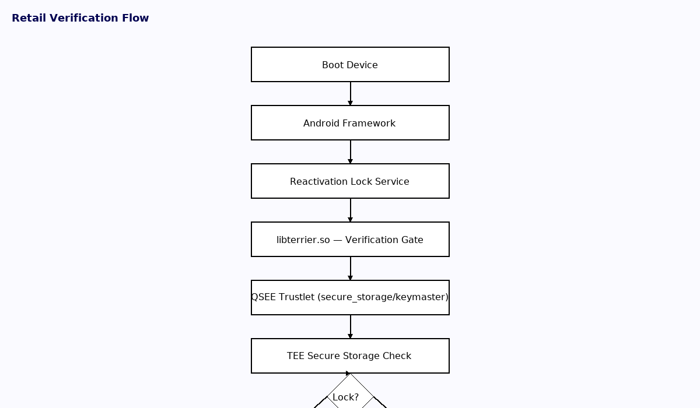
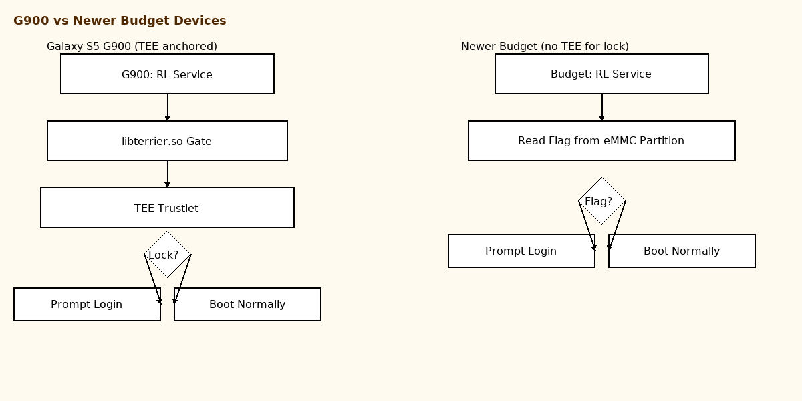
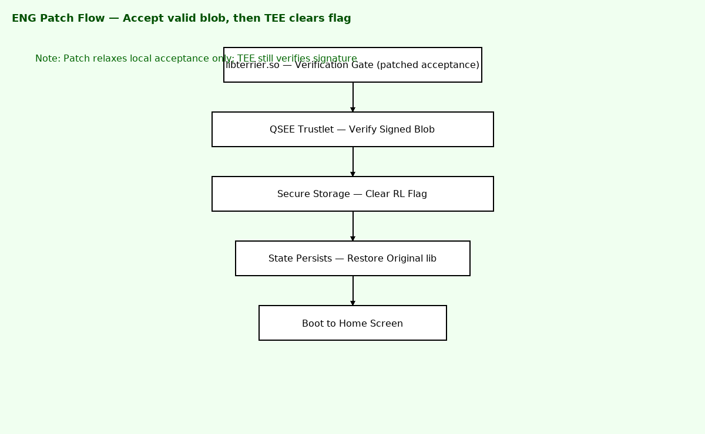

# Legacy Samsung Reactivation Lock Removal — Historical Reference

> **Disclaimer:**  
> This repository is for **historical and educational purposes only**.  
> Bypassing Reactivation Lock on devices you do not own or have explicit permission to modify may violate laws in your jurisdiction.  
> Modern Samsung devices have significantly stronger protections, including hardware-bound key attestation, making these methods obsolete.

---

## 📜 Overview

Samsung’s **Reactivation Lock** was designed to deter theft by requiring the original Samsung account credentials after a factory reset.  
On flagship devices like the **Galaxy S5 G900 series**, this lock state was stored in **Qualcomm’s Secure Execution Environment (QSEE)**, making it more resilient to basic bypass attempts.

This repository documents a method that worked **only on Engineering (ENG) builds** of certain legacy Samsung devices.  
The bypass short-circuits the normal verification flow before the TEE is consulted, allowing the device to boot as “unlocked.”

---

## 📱 Devices Observed

Tested on ENG builds for the following series:

- G870A  
- G900 series (A / P / T / V)  
- J100 series (V / VPP)  
- N900 series (A / P / T / V)  
- N910 series (A / P / T / V)  
- T817A  

---

## 🔍 Reactivation Lock Verification Flow (Retail Firmware)



**Key points:**
- Retail firmware queries **QSEE** to confirm lock state.  
- Lock state in secure storage **survives** partition wipes.  
- Only exploitable in ENG builds where signature verification is relaxed.

---

## 🆚 G900 vs. Newer Budget Devices



---

### Why This Matters
- **G900 series:** Hardware-backed QSEE storage meant lock survived wipes.  
- **Budget devices:** Some dropped TEE storage, using raw partitions instead, making them vulnerable to a “wipe-to-unlock” method.  
- **Lesson:** Even with TEE, if normal world checks can be patched, the secure world may never be consulted.

---

## 🛠 ENG Build Patch Flow (Bypass Method)



---

## 🔧 ENG Build Process (Historical)

1. **Obtain ENG root firmware** for the target device.  
2. **Pull** `libterrier.so` from `/system/lib/`.  
3. **Identify** the verification function in IDA or Ghidra that calls `EVP_PKEY_verify`.  
4. **Patch** the instruction to force a successful return (e.g., change `MOVS R6, #0x11` to `MOVS R0, #1`).  
5. **Push** the patched library back to the device.  
6. **Restart** the framework or reboot.  
7. **Send** the appropriate AT unlock command via modem:  
   ```
   AT+REACTIVE=2,0,<HASH_PLACEHOLDER>
   AT+REACTIVE=2,1,<HASH_PLACEHOLDER>
   ```
8. **Restore** original `libterrier.so` after testing.

---

## ⚠️ Legal & Ethical Notice

- This method was only possible on **engineering/debug builds** where security was intentionally relaxed.  
- Attempting to use similar methods on retail devices is not feasible without significant additional exploitation.  
- Modern Samsung devices implement full secure boot + hardware key attestation, making this approach obsolete.

---

## 📚 References

- [Qualcomm QSEE Overview](https://developer.qualcomm.com/software/secure-execution-environment)  
- [Samsung Knox Platform](https://www.samsungknox.com)  
- [GlobalPlatform TEE Standard](https://globalplatform.org/specs-tee/)
